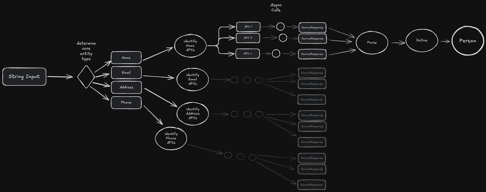

# Person Finder

> A CLI, API, and ESM library for gathering information on people
> via a host of source API's.

## Intention / Goal of the Library

The goal of this library is to allow you to provide any of the following:

- a phone number
- a postal address
- an email address
- or a Person's name

and this library will -- in parallel -- call a set of API's to find information
about "the Person" the search term was implying. The kinds of data we want to
surface about a person would include:

- Name, address(es), email(s), and phone number(s) of the person
- Social media accounts
- Job history
- Political offices held (if any)
- Any news articles on the given person (if any)
- Birthday
- more?

## Design Approach

### Source API's

- We have identified a set of API's found under the `./src/sources` directory which find information out about a person based on simple identifying characteristic of a person (see "Core Inputs" section).
- Some of these API's are meant to pickup information about people at large but we also have apis which focus on:
	- Music (aka, artists or writers)
	- Movies (aka, actors)
	- Politics
		- In this case we use some API's which are global
		- but to get more and more detailed information, we have API's for USA and UK which we use
		- may add other countries as demand for it increases

#### Technical Details

- For every API we're looking to use there will `1:M` API endpoints that we might be interested in calling to achieve our goal of getting more information about the Person
- For each API endpoint we'll make a call to the `createApiEndpoint` and export the resulting symbol.
- the `createApiEndpoint()` utility is used to express the full lifecycle of a request/response cycle for an API endpoint
			- currently the implementation only supports REST endpoints but eventually will grow to include at least Websocket and possibly GRPC
			- Requests:
				- we expect a lot of the API calls to only require a `string` parameter to make the request
				- this assumption is based on the relative simplicity of our [[#Core Inputs and Secondary Filters|Core Inputs]]
				- but RESTFUL API's can expose their parameters in many places including:
					- body (as form input, as JSON)
					- header (as key/value pair)
					- url parmeters
					- path parameters
				- the `createApiEndpoint()` definition allows you to express both any/all of the request parameters but also allows you to map these inputs to _where_ in the API surface the parameters should be placed.
			- Responses:
				- we expect that most API calls will provide JSON response with the matches it's found
				- the `createApiEndpoint()` function allows for us to express the following:
					- the `outputStructure` which maps to the "crude type" of the Response we'll get back from the API endpoint (aka, `json`, `text`, `yaml`, `formFields`); again we expect this to mainly be `json` but it could possibly vary
					- the `outputType()` allows us to be more granular in expressing the shape/type of the passed back structure
						- it is only available if the `outputStructure` is set to `json` or `yaml`
						- if is set to `yaml` then we'll convert the yaml representation to an JS object using the popular `js-yaml` **npm** package.
						- in both cases we can model the shape using the `inputType` property of `createApiEndpoint()`
			- Post Processing:
				- the `postProcessor` property of `createApiEndpoint()` allows us to get a strongly typed response from the API and mutate it to a different structure
				- In our case we'll want to mutate results into a "common format" so that downstream of this point we can deduplicate the results as well as present them in a more uniform manner
				- the `postProcessor` property is just a callback which allows us to mutate our data between two known structures
					- in the case of this repo, we will ensure that all endpoints produce a `SourceResponse` type

### Core Inputs and Secondary Filters

- the **Core Inputs** are:
	- name
	- email
	- postal address
	- phone number
- to be a **Core Input**, there must be at least one API which allows for searching on this input as the means of identifying info on the user
- in addition to **Core Inputs** there are **Secondary Filters** which help to narrow down results:
- **Secondary Filters** are:
	- any **Core Input** property that is _not_ being used as the Core Input for a given query can be used to filter down results as a **Secondary Filter**
	- beyond this, we also offer the following properties which can be used as a filter:
		- `country`
		- `state` or `region`
		- `city`
		- `postcode` or `zipcode`
		- `gender`
		- boolean flags: `politician`, `musician`, `writer`, `celebrity`, `actor`, `executive`
	- the filters which are specified may or may not be useful for narrowing down the results from a given API endpoint but where they _can_ be used, they _will_ be used.
	- any filter which leads with the `!` character will be treated as a negation

### Fan Out and Deduplication

In the box called "Call API" above this repo will actually be calling _every_ API and then combining the results rather than just a single API as the simplified diagram above suggests.

Below is a diagram that illustrates this "fan-out", "converge-in" pattern:

  

In this stage, we're calling out that when a person's "email" is provided then only a subset of the overall API's will be called to identify the person but those which can search on email will all be called in parallel.

Once all the results are returned, we will need to take the raw API results and run them through a "deduplication" process so that we report back information to the caller in as succinct a manner as possible.

### Caching

As the cost -- in time and resources -- of making all these API calls and deduplicating their results is not insignificant, we will want to cache the deduplicated results.

Caching will be done to a SQLite database local to the file system.
